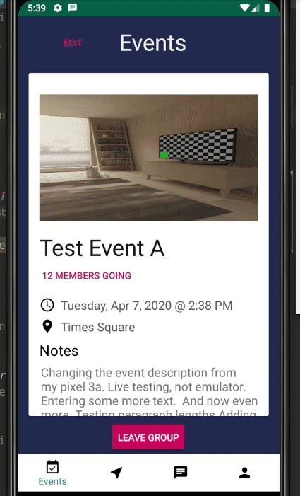
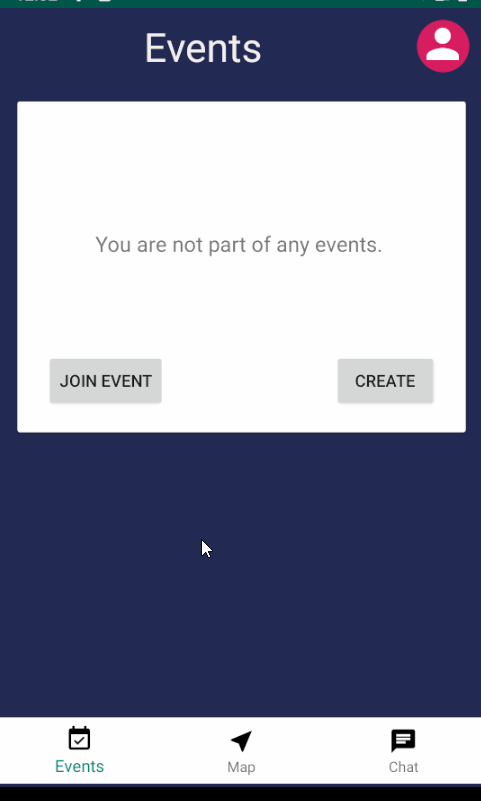

# Group Tracker

Group Tracker is an Android application that makes it easier to plan trips with friends. Users can join or create events, communicate in a group chat and share their location with each other. The map displays live locations of all members in the group to make it easier to meet up and plan their commute. If a user is lost, they can send out a notification to all group members which contains their location, battery percentage and other useful information. 

Developer: **Syed Sadman**

# Features
The app has the following features:

* [ ] User Profile
	* [X] Sign in and register  
	* [X] Users can set profile pictures and status
	* [ ] Edit profile information    

* [ ] Create and Join events
    * [X] View/Join list of events with persistence
    * [X] Create new events
    * [X] Edit events
    * [ ] Password protected 

* [ ] View Shared Map
    * [X] Display live location for all members on map
    * [X] Click to move map to specific user or location
    * [X] Show Notifications for users that need help
	* [ ] TBD

* [ ] Chat Window
	* [X] Multiple users can communicate 
	* [ ] Share media
	* [ ] Personal chats
	* [ ] TBD 

Maps Update

 

Event Viewer Update           

 

## Notes
- Firebase - Does not support arrays directly since array index is always changing and firebase is a real time db.  Creates problems when multiple users doing operations, array index shifts. Instead, it creates list of objects
- Always remember to detach listeners when needed
- How to set ItemClick on RecyclerView:

## Bugs/Challenges:
- Allowing users to join and leave events => create static User.eventid and use MainActivity to redirect to appropriate event. Also update firebase Users.json with an eventid status and maintain a members list in Events.json
- AutocompletePlacesFragment was depricated => Used newer PlacesAPI 
- DialogFragment for places api, null pointer when using it on fragments => launch activity instead when user clicks location edit text
- RecylerView only shows 1 item => layout_height of LinearLayout was set to to match_parent. Replaced Volley with DataSnapshot
- Creating and updating members list in firebase => Create user objects inside members since Firebase doesnt support arrays directly. Then easily get child.getvalue() for each  member
- Finding a way to upload image into firebase and retrieve it, without new dependencies and saving space on database =>  Encode image into base64 String and save to Firebase
- Picking image from gallery and uploading it to ImageView => https://demonuts.com/pick-image-gallery-camera-android/
- Images not getting pushed to firebase, somehow broke => Created Logs to test, suddenly works?
- Firebase doesn't create event with all fields, only createdBy and Date. Sometimes works => Create Event object, removed wrong reference, push class to firebase instead
- After creating event, doesn't launch new event. Sometimes works, sometimes doesn't => Changed from Volley to Firebase Datasnapshot. Same solution as below
- Cannot create new event after leaving event, new content isnt pushed to firebase => BUG:reference.child(key).setValue(key) was removed 
- ** When deleting event, it just keeps redirecting back to ViewEventsFragment instead of going to main. If event is not deleted, it works as intended. 
  - Tried different intents, passing extras, putting null conditions around ViewEventsFragment
  - Tried deleting from Main activity, still goes back to ViewEventFragment. 
  - Set null within delete function or launch intent within delete
  - Even if I delete it from random activity such as MapActivity, it automatically goes into ViewEventsFragment and crashes. Every deletion seems to be linked to ViewEventsFragment 
  - Switch to Main, wait 5 seconds, then delete event. After the 5 seconds, app crashes in ViewEventsFragment. It switches intents, loads new fragment, waits 5 seconds then crashes in the previous fragment. 
  - The only way to get to ViewEventsFragment is if User.eventid != "null". However, app ignores this and crashes in ViewEventsFragment even though I manually changed User.eventid to "null" upon deletion. 
  ==> Restructure and add a removeEventListener. When I added an addEventListenr,it was ALWAYS listening for onDataChanged. When event was deleted, this was set to null so it was trying to fetch null data which caused it to crash. Every listener registered needs to be unreggistered!
  - Location doesnt work despite beign turned on --> Enable in app location permissions
  - Recyclerview for users list overlaps users when fragment is stopped and resumed --> Clear adapter onStop()
  - Notifications not showing up - Need to setup createNotifcationChannel() and call it onViewCreated(). Then, pass in getContext() with a string as channel_id (this must be the same as delcared in createNotificationChannel()). Notfication wont show so need to call NotifiationManagerCompat and call .notiify(...) with a unique id for each notification. 

## Resources Used

Images 
https://stackoverflow.com/questions/36117882/is-it-possible-to-store-image-to-firebase-in-android
https://www.thecrazyprogrammer.com/2016/10/android-convert-image-base64-string-base64-string-image.html
https://demonuts.com/pick-image-gallery-camera-android/

Search event location
https://developers.google.com/places/android-sdk/autocomplete
https://www.youtube.com/watch?v=6Trdd9EnmqY
https://medium.com/skillhive/android-google-places-autocomplete-feature-bb3064308f05

Location
https://stackoverflow.com/questions/10311834/how-to-check-if-location-services-are-enabled
https://www.youtube.com/playlist?list=PLgCYzUzKIBE-SZUrVOsbYMzH7tPigT3gi
https://medium.com/@shubham9032/structure-for-group-chat-using-firebase-583a84d794c2
- Follow user location
https://stackoverflow.com/questions/44992014/how-to-get-current-location-in-googlemap-using-fusedlocationproviderclient

Notifications
https://developer.android.com/training/notify-user/build-notification
https://code.tutsplus.com/tutorials/android-o-how-to-use-notification-channels--cms-28616

Chat
https://www.scaledrone.com/blog/android-chat-tutorial/
https://blog.sendbird.com/android-chat-tutorial-building-a-messaging-ui/

## License

    Copyright 2019 Syed Sadman

    Licensed under the Apache License, Version 2.0 (the "License");
    you may not use this file except in compliance with the License.
    You may obtain a copy of the License at

        http://www.apache.org/licenses/LICENSE-2.0

    Unless required by applicable law or agreed to in writing, software
    distributed under the License is distributed on an "AS IS" BASIS,
    WITHOUT WARRANTIES OR CONDITIONS OF ANY KIND, either express or implied.
    See the License for the specific language governing permissions and
    limitations under the License.

