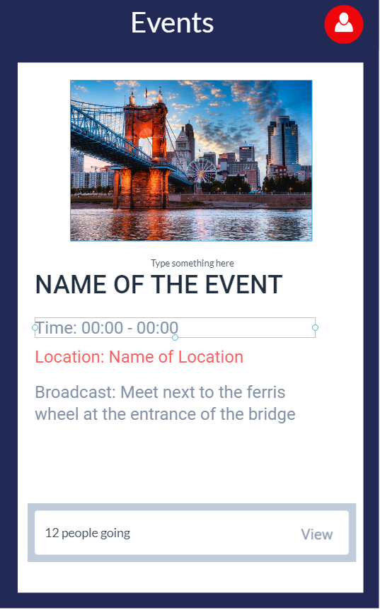

# Group Tracker

Group Tracker is an Android application that provides users with an interface designed to help make traveling easier and safer. Users can join or create events, communicate in a group chat and view a shared map. The map will display a live location of all members in the group and allow them to set messages or alerts. 

Developer: **Syed Sadman**

# Features
The app has the following features:

* [X] Users can sign in and register  
* [ ] Create and Join events
    * [X] Rediredct users to default or events activity
    * [X] View/Join list of events
    * [X] Persist joined events
    * [X] Create new events
    * [X] Set images for events
    * [ ] Events can be open or password protected
    * [ ] Allow users to be invited to an event group
    * [X] Autocomplete location
    * [X] Setup GPS to location
    * [ ] Edit events
    * [ ] Admin can remove members from group
* [ ] Configure Shared Map
    * [ ] Show marker for all members
    * [ ] Enable live preview
    * [ ] Set common destination marker
    * [ ] Broadcast message 
* [ ] Group chats 
* [ ] Photo Sharing
* [ ] TBA

Preview             
:-------------------------:
 

## Notes
Firebase - Does not support arrays directly since array index is always changing and firebase is a real time db. Creates problems when multiple users doing operations, array index shifts. Instead, it creates list of objects

Images 
https://stackoverflow.com/questions/36117882/is-it-possible-to-store-image-to-firebase-in-android
https://www.thecrazyprogrammer.com/2016/10/android-convert-image-base64-string-base64-string-image.html
https://demonuts.com/pick-image-gallery-camera-android/
USing PlaceAUtoCompleteFragment to get location
https://developers.google.com/places/android-sdk/autocomplete
https://www.youtube.com/watch?v=6Trdd9EnmqY
RecyclerView in Dialog

PlacesAPI Autocomplete
https://medium.com/skillhive/android-google-places-autocomplete-feature-bb3064308f05

Bugs/Challenges:
- Allowing users to join and leave events
- Figuring out how to structure objects correctly in firebase
- AutocompletePlacesFragment was depricated - Used newer PlacesAPI
- DialogFragment for places api - null pointer when using it on fragments
- RecylerView only shows 1 item - layout_height of LinearLayout was set to to match_parent
- Creating and updating members list in firebase
- Finding a way to upload image into firebase and retrieve it, without new dependencies and saving space on database -  Encode image into base64 String and save to Firebase
- Picking image from gallery and uploading it to ImageView
- Removing all members in an event from firebase. Cant loop through members list - 
- Images not getting pushed to firebase, somehow broke - Created Logs to test, suddenly works?
- Firebase doesn't create event with all fields, only createdBy and Date. Sometimes works - Create Event object and push class to firebase instead
- After creating event, doesn't launch new event. Sometimes works, sometimes doesn't - Changed from Volley to Firebase Datasnapshot
- When deleting event, doesnt launch intent to MainActivity
- Cannot create new event after leaving event, new content isnt pushed to firebase - BUG:reference.child(key).setValue(key); 

https://www.youtube.com/playlist?list=PLgCYzUzKIBE-SZUrVOsbYMzH7tPigT3gi
https://medium.com/@shubham9032/structure-for-group-chat-using-firebase-583a84d794c2

## License

    Copyright 2019 Syed Sadman

    Licensed under the Apache License, Version 2.0 (the "License");
    you may not use this file except in compliance with the License.
    You may obtain a copy of the License at

        http://www.apache.org/licenses/LICENSE-2.0

    Unless required by applicable law or agreed to in writing, software
    distributed under the License is distributed on an "AS IS" BASIS,
    WITHOUT WARRANTIES OR CONDITIONS OF ANY KIND, either express or implied.
    See the License for the specific language governing permissions and
    limitations under the License.

