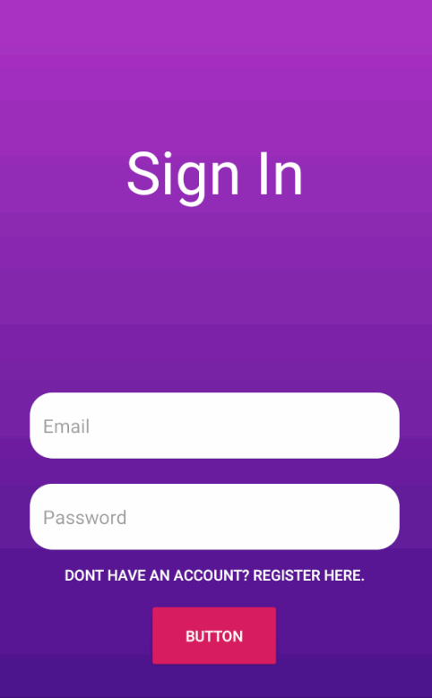

# Group Tracker

Group Tracker is an Android application that provides users with an interface designed to help make traveling easier and safer. Users can join or create events with a group chat and view a shared map. The map will display a live location of all members in the group and allow them to broadcast messages.

Developer: **Syed Sadman**

# Features
The app has the following features:

* [X] Users can sign in and register  
* [ ] Create and Join events
    * [X] Rediredct users to default or events activity
    * [X] View/Join list of events
    * [/] Persist joined events
    * [/] Create new events
    * [ ] Set images for events
    * [ ] Events can be open or password protected
    * [ ] Allow users to be invited to an event group
    * [X] Autocomplete location
    * [/] Setup GPS to location
    * [ ] Admin can remove members from group
* [ ] Configure Shared Map
    * [ ] Show marker for all members
    * [ ] Enable live preview
    * [ ] Set common destination marker
    * [ ] Broadcast message 
* [ ] Group chats 
* [ ] TBA

Preview             
:-------------------------:

 

## Notes
Thought process is detailed in commit messages
Images 
https://stackoverflow.com/questions/36117882/is-it-possible-to-store-image-to-firebase-in-android
USing PlaceAUtoCompleteFragment to get location
https://developers.google.com/places/android-sdk/autocomplete
https://www.youtube.com/watch?v=6Trdd9EnmqY
RecyclerView in Dialog

PlacesAPI Autocomplete
https://medium.com/skillhive/android-google-places-autocomplete-feature-bb3064308f05

Challenges Encountered:
- Allowing users to join and leave events
- Figuring out how to structure objects correctly in firebase
- AutocompletePlacesFragment was depricated
- DialogFragment for places api - null pointer when using it on fragments

https://www.youtube.com/playlist?list=PLgCYzUzKIBE-SZUrVOsbYMzH7tPigT3gi
https://medium.com/@shubham9032/structure-for-group-chat-using-firebase-583a84d794c2

## License

    Copyright 2019 Syed Sadman

    Licensed under the Apache License, Version 2.0 (the "License");
    you may not use this file except in compliance with the License.
    You may obtain a copy of the License at

        http://www.apache.org/licenses/LICENSE-2.0

    Unless required by applicable law or agreed to in writing, software
    distributed under the License is distributed on an "AS IS" BASIS,
    WITHOUT WARRANTIES OR CONDITIONS OF ANY KIND, either express or implied.
    See the License for the specific language governing permissions and
    limitations under the License.

